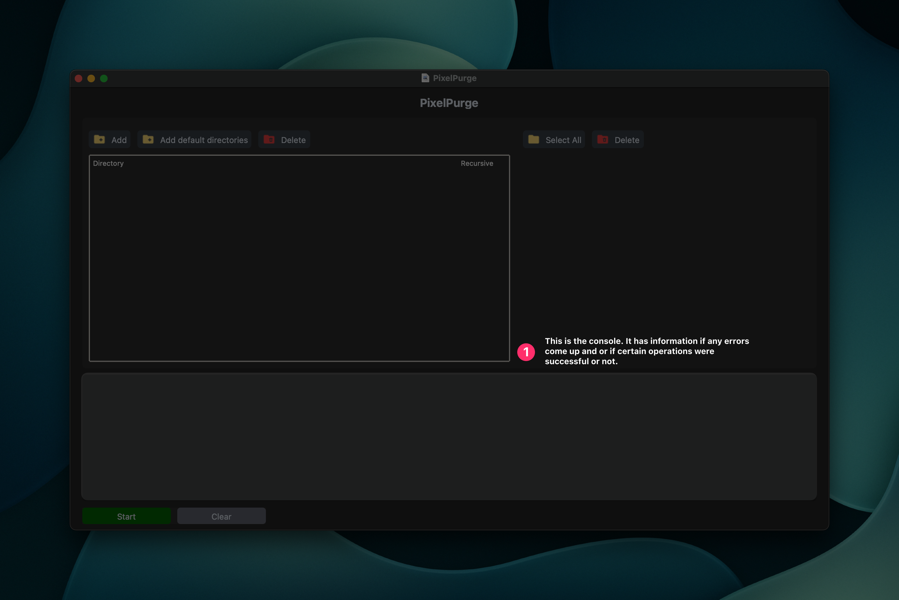

# PixelPurge

PixelPurge is a simple, efficient tool for gamers who love testing new games but want to keep their system clean. It allows you to quickly delete game-created files and folders, making it easy to fully uninstall games.

Whether you're trying out multiple games or need a quick way to clear out leftover files after uninstalling, PixelPurge gives you control over your system's storage without any hassle.


## Features

- **Effortless Game Cleanup**: Easily remove game-created files and directories after trying out games.
- **Directory Monitoring**: Tracks new folders created in specific locations while games run.
- **Selective Deletion**: Use a GUI to review and delete only the files you want.
- **No Clutter Left Behind**: Ensure complete removal of unwanted game data.


## Why Use PixelPurge?

Testing out games can leave behind unnecessary files in your system, especially in directories like `AppData`. PixelPurge simplifies this cleanup process, allowing you to focus on finding your next favorite game without worrying about leftover clutter.
Just make sure to click the start button when you are about to play a game.


## Requirements

- Python 3.7 or newer
- Windows/macOS (this application is designed for windows but still works for macOS)

Install the required packages using:
```bash
pip install -r requirements.txt
```

## Usage
Windows:
```bash
python main.py
```
MacOS:
```bash
python3 main.py
```

## Getting started

*This is where all of your directories to monitor are stored.*


*You can add and delete directories to monitor. The default directories button inputs the most commonly used folders where games are stored.*


*When clicking the add button a popup will appear asking you for the directory path and whether not if it is recursive. The folder button to the right allows for selecting directories via the file system. **(Note: The directory to be added must exist).***


*This list contains all the newly created files that were detected.*


*The buttons shown allow you to delete them individually or all at once.*


*This is the console. It has information if any errors come up and or if certain operations were successful or not.*


*This is the control panel. The start button starts monitoring the folders for any new additions. The clear button clears the output console.*